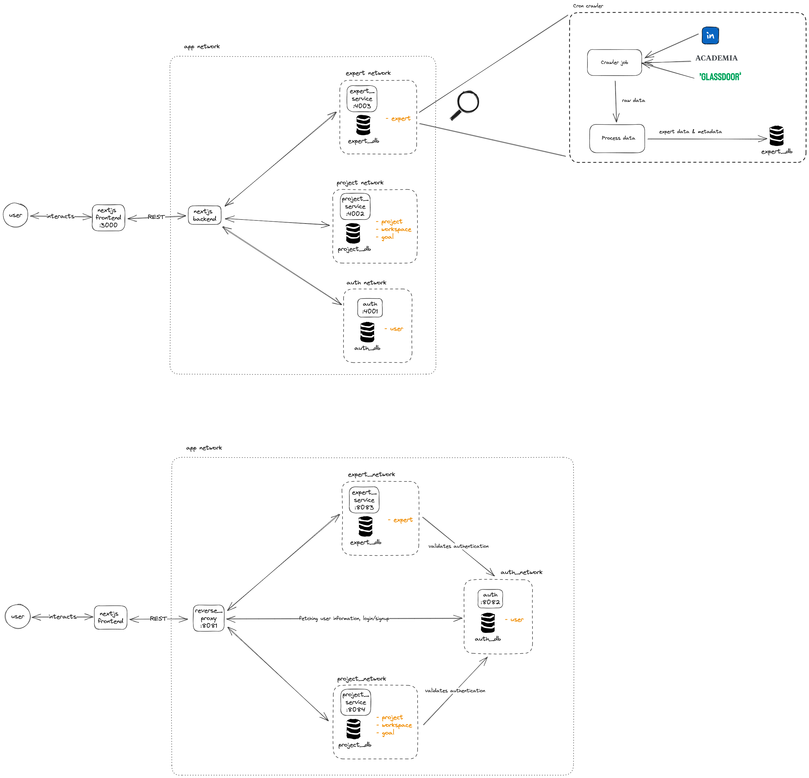
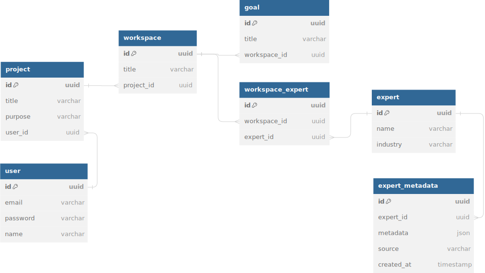

<!-- title -->
Expert Finder project
## Design

### Architecture diagram
There are 2 considered designs in the diagram below, currently we are implementing the first one as NextJS backend could play the role of the reverse proxy.


### Data modelling


### User flow


### Expert search method
This functionality is implemented by harnessing the power of a vector database (Chromadb in this case). Experts data is queried and then feed into the self-hosted Chroma collection in the docker instance. User then can type a query message, e.g. `Experts in technology`, and the vector db will find the most similar record to return to the user.


## Postman API documentation
https://documenter.getpostman.com/view/13640085/2s9YBz3b7o

## How to run?
### Prerequisite
- Docker
- Compose
  
### Then run:

```
docker compose -f docker-compose.yml up
```
### Use the app
Open http://localhost:3000/ on a browser

### Run the app in Dev mode
```zsh
cd web/frontend
npm i
npm run dev

```

## Progress
- [x] Sig in (wrong credentials UI and input valiation is not handled yet in the FE)
- [x] Sign up
- [x] Sign out
- [x] List projects
- [x] List workspace
- [x] Experts list of project and workspace
- [x] Expert relationship visuallization by a graph network
- [x] Expert search by query
- [ ] Add a new project (partiallly done, API implemented but not FE yet)
- [ ] Add a new workspace (partiallly done, API implemented but not FE yet)
- [ ] Add experts to a workspace to create an expert db
